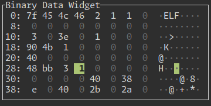

# Ratatui Binary Data Widget

Widget built to show Binary Data.

Inspired by tools like `xxd`.

Built for the specific use case of [`mqttui`](https://github.com/EdJoPaTo/mqttui).
Might work for other projects too.

There was no use case for big files so far so the whole binary data is required to be kept in RAM currently.
