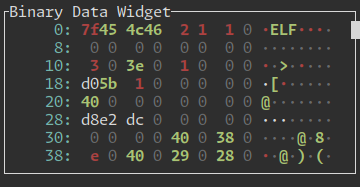

# Ratatui Binary Data Widget

Widget built to show Binary Data.

Inspired by tools like `xxd`.

Built for the specific use case of [`mqttui`](https://github.com/EdJoPaTo/mqttui).
Might work for other projects too.
Could be published on <https://crates.io> but as long as I am the only user I don't see much benefit.
Feel free to open an issue.
